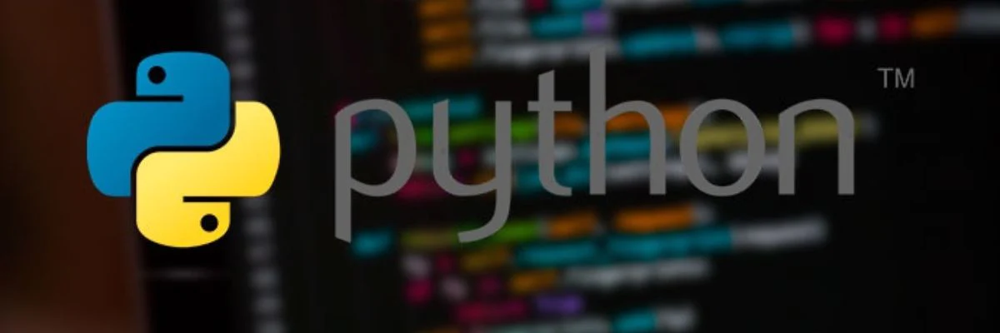

<p align="center"></p>
<h1 align="center"> Python Guide </h1> 
<h4 align="right">March 24</h4>


<br>

# Table of contents
- [Table of contents](#table-of-contents)
- [Python Virtual Environment (Windows/Linux)](#python-virtual-environment-windowslinux)
  - [Activar (estando dentro de la carpeta que contiene el venv):](#activar-estando-dentro-de-la-carpeta-que-contiene-el-venv)
  - [Comandos Importantes](#comandos-importantes)
  - [Usar el entorno virtual sin activarlo](#usar-el-entorno-virtual-sin-activarlo)
  - [Removing virtual environments](#removing-virtual-environments)
  - [¿Qué pasa si NO usas un entorno virtual? (Instalación Global)](#qué-pasa-si-no-usas-un-entorno-virtual-instalación-global)
- [Installing Libraries via a Requirements File](#installing-libraries-via-a-requirements-file)
  - [Crear  requirements.txt de un entorno virtual](#crear--requirementstxt-de-un-entorno-virtual)
  - [Checking Environment Integrity](#checking-environment-integrity)
  - [Updating Dependencies](#updating-dependencies)
- [Install on RPi](#install-on-rpi)
  - [Python Virtual Environment (RPi)](#python-virtual-environment-rpi)
  - [Automatically Running at Boot (Systemd)](#automatically-running-at-boot-systemd)
  - [Run service](#run-service)
  - [Stop service](#stop-service)
  - [Automatically enabling venv at login](#automatically-enabling-venv-at-login)
- [Troubleshooting](#troubleshooting)
  - [Opción 1 - Invocar con sudo pasando el entorno](#opción-1---invocar-con-sudo-pasando-el-entorno)
  - [Opción 2 - Usar rutas absolutas](#opción-2---usar-rutas-absolutas)
- [Create a Python Executable for Windows/Linux](#create-a-python-executable-for-windowslinux)
  - [Install](#install)
  - [Estructura](#estructura)
  - [Script Python con GUI (hola mundo) sample](#script-python-con-gui-hola-mundo-sample)
  - [Generar el ejecutable](#generar-el-ejecutable)
  - [Anclar al menú Inicio / barra de tareas](#anclar-al-menú-inicio--barra-de-tareas)
  - [Acceso directo con nombre e icono](#acceso-directo-con-nombre-e-icono)
  - [Incluyendo archivos de datos](#incluyendo-archivos-de-datos)
    - [Samples aditional](#samples-aditional)
- [Uso básico de Venv (Entendiendo un poco más!)](#uso-básico-de-venv-entendiendo-un-poco-más)
  - [Crea el entorno virtual](#crea-el-entorno-virtual)
  - [Activa el entorno virtual](#activa-el-entorno-virtual)
  - [Utiliza el entorno virtual](#utiliza-el-entorno-virtual)
  - [Desactivar el entorno virtual ((opcional))](#desactivar-el-entorno-virtual-opcional)
- [Utilizar paquetes Debian en lugar de módulos Python](#utilizar-paquetes-debian-en-lugar-de-módulos-python)
- [Regresar a los "buenos tiempos de antaño"](#regresar-a-los-buenos-tiempos-de-antaño)
- [Múltiples entornos virtuales](#múltiples-entornos-virtuales)
- [Install on RPi (versiones anteriores a Trixie / Bookworm)](#install-on-rpi-versiones-anteriores-a-trixie--bookworm)
- [Install on Windows](#install-on-windows)
  - [Install PIP en Windows](#install-pip-en-windows)
- [Install on Ubuntu](#install-on-ubuntu)
- [Upgrade pip](#upgrade-pip)
- [Indentación python](#indentación-python)
  - [vscode](#vscode)
  - [Summary coomands Python](#summary-coomands-python)
  - [Check environment variables](#check-environment-variables)
  - [Reinstall a package (Para reinstalar completamente un paquete)](#reinstall-a-package-para-reinstalar-completamente-un-paquete)
  - [Para buscar PyPI para un paquete particular:](#para-buscar-pypi-para-un-paquete-particular)
  - [Para ver detalles sobre un paquete instalado:](#para-ver-detalles-sobre-un-paquete-instalado)
  - [Para enumerar todos los paquetes instalados:](#para-enumerar-todos-los-paquetes-instalados)
  - [Para enumerar todos los paquetes desactualizados:](#para-enumerar-todos-los-paquetes-desactualizados)
  - [Para actualizar un paquete desactualizado:](#para-actualizar-un-paquete-desactualizado)
  - [Para deshacerse completamente de un paquete:](#para-deshacerse-completamente-de-un-paquete)
  - [Update package](#update-package)
  - [remueve package](#remueve-package)
  - [See package version](#see-package-version)
  - [Install a specific version of a package](#install-a-specific-version-of-a-package)
  - [Install a smaller package than the current one](#install-a-smaller-package-than-the-current-one)
- [Carrar una App python](#carrar-una-app-python)
- [Snippets 📎📌✂️](#snippets-️)
  - [Interpolación lineal](#interpolación-lineal)
  - [Clear the screen after each message is printed.](#clear-the-screen-after-each-message-is-printed)
  - [Simple comments (sample)](#simple-comments-sample)
  - [Debug with Led Bliking](#debug-with-led-bliking)
  - [Correr comandos del sistema on python](#correr-comandos-del-sistema-on-python)
  - [En la pantalla](#en-la-pantalla)
  - [En construcción 🚧](#en-construcción-)
- [Como forzar la salida en consola en una misma linea](#como-forzar-la-salida-en-consola-en-una-misma-linea)
- [Read Keyboard](#read-keyboard)
- [Read Gamepad](#read-gamepad)
  
<br>

# Python Virtual Environment (Windows/Linux)
Crear un entorno virtual llamado venv
```bash
python3 -m venv venv 
```
Crear un entorno virtual llamado venv pero le dice a ***venv*** que, además de los paquetes que instales en tu entorno virtual, también tenga acceso a los paquetes instalados globalmente en tu sistema Python.
```bash
python3 -m venv --system-site-packages venv
```


## Activar (estando dentro de la carpeta que contiene el venv):
Linux / macOS
```bash
source venv/bin/activate
```
Windows:
```bash
# Desde Gitbash
source venv/Scripts/activate

# Desde el CMD
venv\Scripts\activate

# desde PowerShell
.\venv\Scripts\Activate.ps1
```

> :memo: **Note:** <br>
> * Cuando se activa un entorno virtual, solo te activa el terminal actual, si se abre otro terminal se debera activar ese nuevo entorno en ese terminal. <br>
> * Se pueden usar rutas absolutas: "source C:/ruta/al/proyecto/venv/Scripts/activate" o "source D:/Desarrollo/MiApp/venv/Scripts/activate". Si la ruta contiene espacios, asegúrate de encerrarla entre comillas, por ejemplo: 
source "C:/Mis Proyectos/App/venv/Scripts/activate" <br>
> * Si el entorno está activado las librerias se instalan exclusivamente en el entorno virtual sin entrar a la carpeta del entorno virtual.
Esa es precisamente la magia del venv: una vez activado, el comando pip se "redirige" para depositar los archivos dentro de la carpeta de tu entorno (ej. env/lib/site-packages) en lugar de en la carpeta raíz de Python de tu sistema.
  

> :warning: **Warning:** Los ambientes virtuales no se pueden copiar de una maquina a otra, porque los scripts dentro de "venv/Scripts" o "venv/bin" tienen rutas absolutas al Python con el que se creó.


##  Comandos Importantes

```bash
echo $VIRTUAL_ENV # devuelve la ruta del entorno virtual. Si no devuelve nada (línea en blanco) significa que no hay ningún entorno virtual activo

echo $env:VIRTUAL_ENV # PowerShell
```

```bash
which python # devuelve la ruta exacta del archivo ejecutable de Python
```

## Usar el entorno virtual sin activarlo
1. Activar el ***venv*** solo para ver la ruta del python 
```bash
source xxxxx/bin/activate
```
2. Vemos la ruta absoluta del python
```bash
which python
```
3. Desactivamos el entorno virtual
```bash
$ deactivate
```
1. Correr archivo python sin el entorno virtual 
```bash
sudo /home/pi/(path)/bin/python3 (/home/pi/file-name).py
```

sample:
```bash
pi@raspberrypi:~ $ sudo /home/pi/blinka/bin/python3 /home/pi/neopix_spinner.py
```

## Removing virtual environments
```bash
rm -rf (env-name)
```

## ¿Qué pasa si NO usas un entorno virtual? (Instalación Global)
Si instalas las librerías directamente en tu terminal sin activar un venv, se instalan a nivel global en tu sistema operativo.

* ```Riesgo de conflictos```: Si el Proyecto A necesita la versión 1.0 de una librería y el Proyecto B necesita la 2.0, no podrás tener ambas instaladas globalmente sin que una rompa a la otra.
* 
* ```Desorden```: Tu instalación principal de Python se llena de paquetes que quizás solo usaste una vez, dificultando la limpieza o el traslado de tus proyectos a otra computadora.
* 
<br>

# Installing Libraries via a Requirements File
Archivo ```requirements.txt``` que especifique la lista de bibliotecas y sus versiones necesarias.

sample:
```bash
# Development libraries

pytest>=6.2.4
flake8>=3.9.2
requests>=2.25.1
beautifulsoup4>=4.9.3
matplotlib>=3.4.2
```

Para instalar todas las bibliotecas enumeradas en este archivo de requisitos
```bash
pip install -r requirements.txt
```
El comando instalará iterativamente todos los paquetes de Python enumerados y sus dependencias. 

> :memo: **Note:** Debe correrse dentro de la carpeta del entorno Virtual

> :bulb: **Tip:** Puedes hacer un ***pip list*** nuevamente para asegurarte de que todo se haya instalado correctamente:

## Crear  requirements.txt de un entorno virtual
```bash
python -m pip freeze
```
Retorna una lista de paquetes instalados, pero el formato de salida es el requerido por ```python -m pip install```

```bash
pip freeze > requirements.txt
```
Creará un archivo de requisitos que especifica todos los paquetes instalados y sus versiones. 

> :memo: **Note:** Es importante mencionar que, nuevamente, por buenas prácticas de programación, los entornos nunca se suben a los repositorios de git, o de cualquier otro manejador de versiones. Por lo tanto, siempre es una excelente idea crear un archivo llamado requirements.txt en el cual almacenaremos el listado de todas las dependencias.

## Checking Environment Integrity
Si en algún momento desea asegurarse de que todas las dependencias del entorno estén actualizadas y sean consistentes, ejecute este comando:
```bash
pip check
```

## Updating Dependencies
Para actualizar todos los paquetes de su entorno virtual a sus últimas versiones, ejecute este comando:
```bash
pip install --upgrade -r requirements.txt
```

<br>

# Install on RPi
Raspberry Pi OS Trixie / Bookworm ya cuentan con Python ver 3.13.5

## Python Virtual Environment (RPi)
A partir del lanzamiento de Bookworm OS para Raspberry Pi el 10 de octubre de 2023 , será obligatorio usar entornos virtuales de Python (venv) al instalar paquetes con pip. Ya no se podrá usar sudo pip . Esto causará problemas y requerirá aprender cosas nuevas. Estos sistemas operativos ya tienen python instalados

> :memo: **Note:** En caso de no tener las herramientas para Python Virtual Environment, se pueden instalar:
```bash
sudo apt update && sudo apt upgrade
sudo apt install python3-venv
```

## Automatically Running at Boot (Systemd)

Creacion del servicio
```bash
sudo nano /lib/systemd/system/(name-service).service
```
code service:
```bash
[Unit]
Description= Description

[Service]
ExecStart=/home/pi/(entorno-virtual) /home/pi/(file-name).py

[Install]
WantedBy=multi-user.target
```

> :memo: **Note:** Tenga en cuenta que sudo *no* se utiliza dentro del archivo de unidad systemd.

> :memo: **Note:** Con este enfoque no es necesario "activar" el venv.


## Run service
```bash
sudo systemctl enable (name-service)
sudo systemctl start (name-service)
```
Este proceso debería ejecutarse cada vez que se inicie el Pi. Esto no generan mucha salida.

## Stop service
```bash
sudo systemctl stop (name-service)
sudo systemctl disable (name-service)
sudo systemctl status (name-service)
```

## Automatically enabling venv at login

Si usas principalmente una Raspberry Pi para ejecutar scripts de Python, activar un entorno virtual cada vez puede resultar tedioso. Al añadir la activación de venv a tu .bashrcarchivo, se activará automáticamente cada vez que inicies sesión.

Por ejemplo, si ***foobarya*** se ha creado un entorno virtual con ese nombre, añade esta línea al final de tu ```.bashrcarchivo```:

```bash
source ~/foobar/bin/activate
```
El entorno virtual se activará junto con el mensaje modificado en cada inicio de sesión.

<br>

# Troubleshooting
> :warning: **Warning:** Existen librerias que generalmente desconocen el entorno virtual en el que estan trabajando, generan errores como ```ModuleNotFoundError: No module named 'board'``` o ```Can't open /dev/mem: Permission denied```, y no se solucionan usando un ***sudo***

Para solucionar esto existen 2 opciones:

## Opción 1 - Invocar con sudo pasando el entorno
Enruta python en el ambiente virtual:
```bash
sudo -E env PATH=$PATH python3 (/home/pi/file-name).py 
```

## Opción 2 - Usar rutas absolutas
Usar el entorno virtual sin activarlo
1. Activar el ***venv*** solo para ver la ruta del python 
```bash
source xxxxx/bin/activate
```
2. Vemos la ruta absoluta del python
```bash
which python3
```
3. Desactivamos el entorno virtual
```bash
$ deactivate
```
4. Usamos el entorno virtual sin activarlo
```bash
sudo /home/pi/(path)/bin/python3 (/home/pi/file-name).py
```

<br>

# Create a Python Executable for Windows/Linux
Es una herramienta que permite empaquetar código Python en un ejecutable, agrupando todas sus dependencias. Este ejecutable se puede ejecutar con un simple doble clic, sin necesidad de tener Python instalado.

## Install
```bash
pip install pyinstaller
pip install --upgrade pyinstaller
```

## Estructura
```
mi_app/
 ├─ app.py (GUI-demo.py)
 └─ icon.ico (favicon.ico)
 ```

## Script Python con GUI (hola mundo) sample
GUI-demo.py
```bash
import tkinter as tk

root = tk.Tk()
root.title("Mi App")
root.geometry("300x150")

label = tk.Label(root, text="Hola mundo", font=("Arial", 16))
label.pack(expand=True)

root.mainloop()
```

## Generar el ejecutable
```bash
pyinstaller --onefile --windowed --icon=(name-icon).ico (name-file-python).py # sample

pyinstaller --onefile --windowed --icon=favicon.ico GUI-demo.py.py # mi code
```
> :memo: **Note:** El archivo .exe se encontrará dentro de la nueva carpeta llamada dist. 

Opciones:
* --onefile → un solo .exe

* --windowed → sin consola

* --icon → icono del ejecutable

## Anclar al menú Inicio / barra de tareas

Copia app.exe a una carpeta fija (por ejemplo C:\Program Files\MiApp\).

Clic derecho → Anclar a Inicio <br>
o abre el ejecutable → clic derecho en el icono de la barra → Anclar a la barra de tareas.

## Acceso directo con nombre e icono

Clic derecho → Crear acceso directo

Propiedades → Cambiar icono → selecciona tu .ico

Ese acceso directo lo puedes anclar también.

## Incluyendo archivos de datos
En este comando, 'data\data_file.txt;data'le indica a PyInstaller que lo tome data_file.txtdel datadirectorio y lo coloque en el datadirectorio de la aplicación incluida.

Comando de shell (Windows):
```bash
pyinstaller --onefile --add-data 'data\data_file.txt;data' app_with_data.py
```
Comando de shell (Linux/Mac):
```bash
pyinstaller --onefile --add-data 'data/data_file.txt:data' app_with_data.py
```

### Samples aditional
```bash
pyinstaller --onefile --add-binary 'libs\example.dll;.' tu_script.py
```
En este comando, 'libs\example.dll;.'se le indica a PyInstaller que lo tome example.dlldel libs directorio y lo coloque en el directorio raíz de la aplicación incluida ( .es decir, la raíz de la carpeta de distribución de su aplicación).

```bash
pyinstaller --onefile --add-binary 'libs/example.so:.' tu_script.py
```
Aquí, 'libs/example.so:.'le indica a PyInstaller que incluya example.so el libs directorio en la raíz de la carpeta ejecutable.

<br>

<br>

# Uso básico de Venv (Entendiendo un poco más!)
Los pasos básicos son:

Crear el entorno virtual (venv) - esto se hace una sola vez (por cada entorno virtual).
Activar el entorno virtual (venv): esto se hace cada vez que se va a utilizar un entorno virtual.
Usa el entorno virtual (venv): ejecuta tu código Python aquí.
Desactivar el entorno virtual (opcional)

## Crea el entorno virtual
```bash
python3 -m venv (nombre-entorno-virtual) # Creó una nueva carpeta con el nombre del entorno virtual y configuró una estructura de carpetas que imita la disposición que espera el intérprete de Python.
python -m venv env --system-site-packages # acceso a los paquetes instalados globalmente en tu sistema Python.
```

## Activa el entorno virtual
```bash
source (nombre-entorno-virtual)/bin/activate
```

## Utiliza el entorno virtual
Una vez activado el entorno virtual, el uso de Python se desarrolla de forma normal. La ejecución de python cualquier comando pipse realizará en el contexto del entorno virtual.
> :memo: **Note:** Sin importar donde esta el archivo python
```bash
sudo -E env PATH=$PATH python3 i2samp.py # sample
```

> :memo: **Note:** Los módulos instalados con pip se colocarán en las carpetas venv locales; no se debe usar sudo .

## Desactivar el entorno virtual ((opcional))
```bash
deactivate
```
> :memo: **Note:** Esto no es un comando de Linux . Este "comando" es una función de shell definida en el activatescript cuando se ejecutó originalmente. Simplemente deshace lo que hizo el script de activación.

<br>

# Utilizar paquetes Debian en lugar de módulos Python
Existen dos formas generales de instalar módulos de Python:

```pip``` - Esta es la herramienta específica de Python para instalar módulos de Python.

<br>

```apt```  - Esta es la herramienta del sistema operativo para instalar paquetes a nivel de sistema ( apt-get es generalmente lo mismo).

Usar `sudo` con `apt` es correcto . De hecho, suele ser necesario, ya que los paquetes se instalarán en ubicaciones protegidas a nivel de sistema. Sin embargo, usar `sudo` con `pip` es potencialmente peligroso . Por lo tanto, instalar módulos de `pip` a nivel de sistema (mediante `sudo`) generalmente no se recomienda. No obstante, muchos módulos de Python están disponibles como paquetes del sistema operativo (Debian) . Por consiguiente, es posible y correcto instalar estos módulos de Python con `sudo apt install`.

Por ejemplo, para instalar PIL/Pillow :
```bash
sudo apt install python3-pil
```

Esto permitirá que PIL/Pillow esté disponible para cualquier usuario que ejecute Python en la configuración. Sin embargo, los paquetes del sistema operativo generalmente serán versiones anteriores a las disponibles a través de pip. ¿Y tal vez eso no sea un problema? Tendrás que determinarlo según tu caso de uso específico.

<br>

# Regresar a los "buenos tiempos de antaño"
Si te opones totalmente a los entornos virtuales (venv) y no te importa la posibilidad de dañar la configuración de Python de tu sistema, y ​​simplemente quieres seguir haciendo las cosas como antes, puedes volver a habilitar las instalaciones de pip en todo el sistema eliminando un archivo llamado EXTERNALLY-MANAGED que se encuentra en la configuración de Python del sistema. Esto es prácticamente lo mismo que usar la opción `--break-system-packages` mencionada anteriormente.

Por ejemplo, en una Raspberry Pi recién arrancada con Bookworm en ejecución, el archivo se puede encontrar en:
```bash
/usr/lib/python3.11/EXTERNALLY-MANAGED
```
Así que simplemente usa sudo rm para eliminarlo:

```bash
sudo rm /usr/lib/python3.11/GESTIONADO EXTERNAMENTE
```
Ahora puedes instalar todo lo que quieras con sudo pip. Al menos hasta que termine corrompiendo la configuración de Python.

<br>

# Múltiples entornos virtuales

Ten en cuenta que se pueden crear varios entornos virtuales (venv). Cada uno se convierte en una carpeta independiente con todo su contenido. Esto resulta útil para resolver conflictos entre módulos o para atender requisitos específicos. Por ejemplo, FooEditor requiere PyQt 5.9.2 *únicamente*, mientras que BarEditor requiere PyQt 5.12.1 *únicamente*. Se puede configurar un venv para cada uno y así mantener las instalaciones de los módulos de PyQt separadas.

<br>

# Install on RPi (versiones anteriores a Trixie / Bookworm)
Find the latest Python version: https://raspberrytips.com/install-latest-python-raspberry-pi/

``` Option 1 ``` <br>

instala python & pip a la ultima version 
```python
sudo apt update && sudo apt upgrade -y && sudo apt-get install python3-pip && pip install -U pip
```

``` Option 2``` <br>

python
```python
sudo apt update && sudo apt upgrade -y && sudo apt install python3 idle3
```
pip (Python 2.x)-> python / (Python 3.x)-> python3
```python
sudo apt-get install python3-pip -y && sudo python3 -m pip install --upgrade pip
```

```Install the required build-tools```
```python
sudo apt-get install build-essential tk-dev libncurses5-dev libncursesw5-dev libreadline6-dev libdb5.3-dev libgdbm-dev libsqlite3-dev libssl-dev libbz2-dev libexpat1-dev liblzma-dev zlib1g-dev libffi-dev
```
```python
python --version
python3 -V
pip -V
```

<br>

# Install on Windows
Download the latest version for Windows: https://www.python.org/downloads/

## Install PIP en Windows
Las siguientes instrucciones deberían funcionar en Windows 7, Windows 8.1 y Windows 10:

Descargue el script del instalador get-pip.py (https://pip.pypa.io/en/stable/installation/). Si estás en Python 3.2, necesitarás esta versión de get-pip.py. En caso de tener Python 3.3 o 3.4 usar estas versiones de PiP correspondientemente Python 3.3 get-pip.py o Python 3.4 get-pip.py. De cualquier manera, haga clic derecho en el enlace y seleccione Guardar como y guárdelo en cualquier carpeta del pc, como su carpeta de Descargas.

Abra el símbolo del sistema y navegue hasta el archivo get-pip.py.

Ejecute el siguiente comando: 
```python
python get-pip.py
```

📝 Nota: Ejecutar la terminal (CMD o Powershell) con privilegios de administrador

actualizar PIP en windows: 
```python
python -m pip install -U pip
```
```python
python --version
python3 -V
pip -V
```

<br>

# Install on Ubuntu

```python
sudo apt update
```

```python
sudo apt install python3
```
```python
sudo apt install python3
```
Install Supporting Software
```python
sudo apt install build-essential zlib1g-dev libncurses5-dev libgdbm-dev libnss3-dev libssl-dev libreadline-dev libffi-dev wget
```

```python
python --version
python3 --version
pip -V
```
<br>

# Upgrade pip
```python
python -m pip install --upgrade pip 
sudo python3 -m pip install --upgrade pip
```

<br>

# Indentación python
## vscode
indent a whole block manually: select the whole block, and then click ```Tab```. If you want to indent backward, you do it with ```Shift+Tab```. That's it, and I think that can be useful in several places.

<br>

## Summary coomands Python 

## Check environment variables
```python
python -c "import os; print('PYTHONPATH:', os.environ.get('PYTHONPATH')); print('PATH:', os.environ.get('PATH'))"
```
respuesta en RPi:
```
PYTHONPATH: None
PATH: /home/carjavi/.local/bin:/usr/local/sbin:/usr/local/bin:/usr/sbin:/usr/bin:/sbin:/bin:/usr/local/games:/usr/games
```

## Reinstall a package (Para reinstalar completamente un paquete)
```python
pip install --force-reinstall package_name
```

## Para buscar PyPI para un paquete particular:
```python
pip search "query"
```

## Para ver detalles sobre un paquete instalado:
```python
pip show nombre-paquete
```

## Para enumerar todos los paquetes instalados:
```python
pip list
```

## Para enumerar todos los paquetes desactualizados:
```python
pip list --outdated
```

## Para actualizar un paquete desactualizado:
```python
pip install nombre-paquete --upgrade
```

## Para deshacerse completamente de un paquete:
```python
pip uninstall nombre-paquete
```

## Update package
```python
pip install package_name --upgrade
```

## remueve package
```python
pip3 uninstall package_name
python3 -m pip uninstall package_name
```

## See package version
```python
python -c "import package_name; print(package_name.__version__)"
```

## Install a specific version of a package
```python
pip install package_name==2.1.1
python3 -m pip install package_name==0.16.0
```

## Install a smaller package than the current one
```python
pip3 install package_name<1 # se necesita una libreria menor a 1.0.0
```
<br>

# Carrar una App python

```sys.exit()```: Es la opción más común para finalizar un programa de manera controlada. Simplemente cierra el programa y salta al bloque finally si está presente. Termina la ejecución de forma limpia. Un valor de 0 indica que el programa terminó correctamente, mientras que cualquier valor distinto de 0 indica un error.

```os._exit()```: Útil en situaciones donde se necesita salir inmediatamente, sin esperar a que se ejecuten bloques finally. Si necesitas salir inmediatamente sin pasar por los bloques finally o sin limpiar recursos, puedes usar os._exit(). Esta es una forma más abrupta de cerrar el programa.Un valor de 0 indica que el programa terminó correctamente, mientras que cualquier valor distinto de 0 indica un error.

```quit() y exit(```: Estas funciones son sinónimos de sys.exit() pero están diseñadas para ser usadas principalmente en entornos interactivos, como en el intérprete de Python. Útil en el intérprete interactivo, pero no recomendado en scripts formales.

```raise KeyboardInterrupt```: Si quieres simular una interrupción del usuario (Ctrl + C).

> [!IMPORTANT]
> Salir de python desde el terminal quit(). Ctrl + C debe estar programa para que funcione, sample:
```python
import time

def main():
    try:
        print("Presiona Ctrl + C para salir")
        while True:
            time.sleep(1)  # Simulación de alguna operación
    except KeyboardInterrupt:
        print("\nDetención por el usuario (Ctrl + C). Saliendo...")

if __name__ == "__main__":
    main()
```


<br>


# Snippets 📎📌✂️

## Interpolación lineal
```python
# ADC es el valos que estoy leyendo.

def map_value(x, in_min, in_max, out_min, out_max):
    return (x - in_min) * (out_max - out_min) / (in_max - in_min) + out_min

# la salida sera entre 0-100, 7700 equivale a 0 y 8800 equivale a 100
value = map_value(ADC, 7700, 8800, 0, 100)
```

## Clear the screen after each message is printed. 
```python
import time
print(i, end='\r')  --> probar
time.sleep(1)
```

## Simple comments (sample)
```python
"""
This Program is for Voice less video Streaming using UDP protocol 
-------
This is a Server
    - Run Client Code first then run Server Code
    - Configure IP and PORT number of your Server
    
Requirements
    - Outside Connection 
    - IP4v needed select unused port number
"""   
```

## Debug with Led Bliking

Blinking Led:
```python
# pip install RPi.GPIO

import RPi.GPIO as GPIO


def blinking_led(blinks,speed):
    GPIO.setmode(GPIO.BCM)
    GPIO.setup(18, GPIO.OUT)
    try:
        for _ in range(blinks):
            GPIO.output(18, GPIO.HIGH)
            time.sleep(speed)  # Espera ms
            GPIO.output(18, GPIO.LOW)
            time.sleep(speed)  # Espera ms
    finally:
        GPIO.cleanup()  # Limpia la configuración de los pines


if __name__ == "__main__":
     blinking_led(5, 0.5)
```

## Correr comandos del sistema on python
sample: 
```python
import os

os.system('sudo shutdown -h now')
```
## En la pantalla
```python
print('-' * 37) #imprime 37 veces el "-" horizontalmente
```

<br>

## En construcción 🚧

manejo de error python: 
https://controlautomaticoeducacion.com/python-desde-cero/manejo-de-errores-en-python/

```python
try:
    #Some code
except:
    #Executed if error in the try block
else:
    # execute if no exception
finally:
    #some code .... (always executed)
```


# Como forzar la salida en consola en una misma linea
sample:
```python
import time

def print_and_clear():
    for i in range(25):
        print(f"Numero: {i}" , end = "\r")
        time.sleep(0.5)
        
print_and_clear()
```


# Read Keyboard
Install through pypi:
```python
pip install inputs
```
```python
"""Simple example showing how to get keyboard events."""

from __future__ import print_function

from inputs import get_key


def main():
    """Just print out some event infomation when keys are pressed."""
    while 1:
        events = get_key()
        if events:
            for event in events:
                print(event.ev_type, event.code, event.state)

if __name__ == "__main__":
    main()
```

# Read Gamepad
Install through pypi:
```python
pip install inputs
```
```python
"""Simple example showing how to get gamepad events."""

from __future__ import print_function


from inputs import get_gamepad


def main():
    """Just print out some event infomation when the gamepad is used."""
    while 1:
        events = get_gamepad()
        for event in events:
            print(event.ev_type, event.code, event.state)


if __name__ == "__main__":
    main()
```


joystick python
```python
joystick.py 

while True:
    events = inputs.get_gamepad()
    for event in events:
        print(event.ev_type, event.code, event.state)

event.ev_type --> Absolute o Sync
event.code --> ABS_HAT0Y

if event.code == 'BTN_SOUTH' and event.state == 1:
  print('Celebrate!')

* botones
Key BTN_SOUTH


Absolute ABS_RZ
Absolute ABS_HAT0Y

*palanca analoguica izquierda
palanca analogica abajo derecha

```
```python

import inputs

while True:
    events = inputs.get_gamepad()
    for event in events:
        print(event.ev_type, event.code, event.state)
        if event.code == 'BTN_SOUTH' and event.state == 1:
            print('Boton X')
```

https://learn.robotical.io/activity/control-your-marty-with-a-gamepad-using-python-

<br>

---
Copyright &copy; 2022 [carjavi](https://github.com/carjavi). <br>
```www.instintodigital.net``` <br>
carjavi@hotmail.com <br>
<p align="center">
    <a href="https://instintodigital.net/" target="_blank"></a>
</p>


